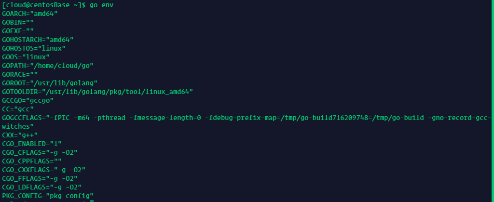
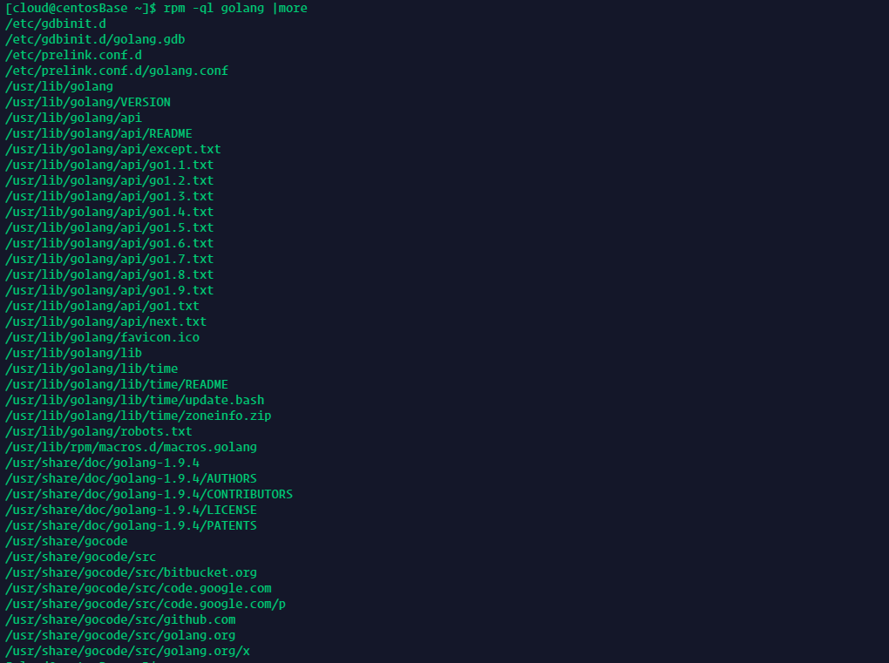
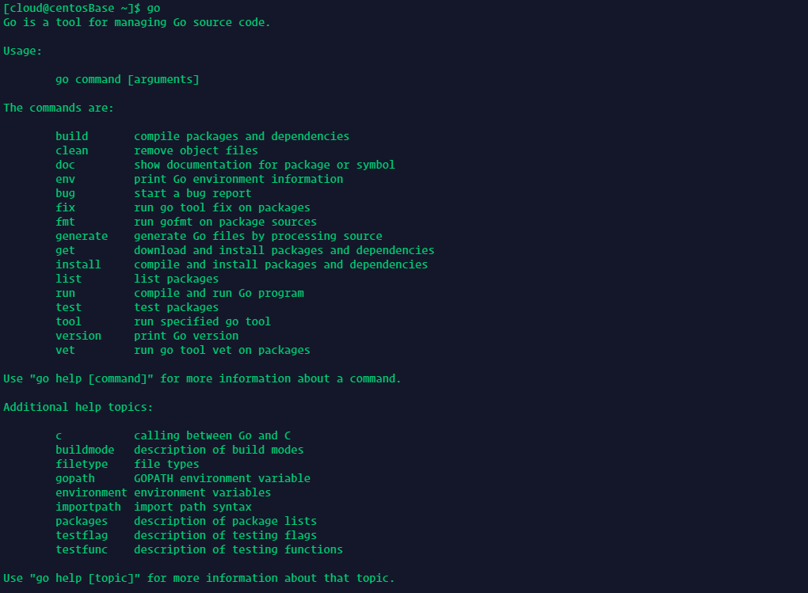
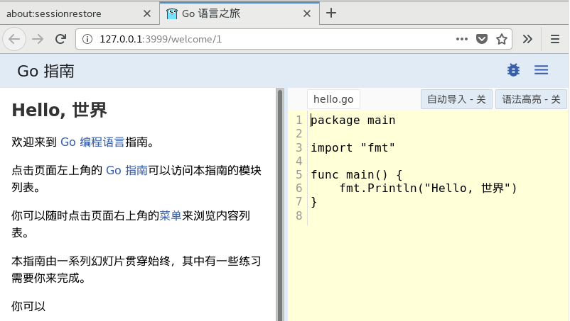

[TOC]

## 1.安装VSCode编辑器

对于CentOS（Fedora、RHEL）系统：

- install the key and repository

```bash
sudo rpm --import https://packages.microsoft.com/keys/microsoft.asc
sudo sh -c 'echo -e "[code]\nname=Visual Studio Code\nbaseurl=https://packages.microsoft.com/yumrepos/vscode\nenabled=1\ngpgcheck=1\ngpgkey=https://packages.microsoft.com/keys/microsoft.asc" > /etc/yum.repos.d/vscode.repo'
```

- update the package cache and install the package using `dnf`

```bash
dnf check-update
sudo dnf install code
```

- - `dnf`包管理器

  `dnf`包管理方式是Fedora18及其以后代替，yum包管理方式的替代品，并且在性能上，得到了很大的优化，此外，Fedora 的自我生态系统–> Fedora中文社区软件源（中文社区软件源）上面提供了很多国人喜爱的`dnf`一键安装的`rmp`软件包。

  ```bash
  (sudo) yum install epel-release -y	# -y表示安装过程中所有问题都为yes
  (sudo) yum install dnf
  ```

  *可能报错：没有可用的`dnf`包*

  ```bash
  # 解决方法：更换源
  wget http://springdale.math.ias.edu/data/puias/unsupported/7/x86_64/dnf-conf-0.6.4-2.sdl7.noarch.rpm 
  wget http://springdale.math.ias.edu/data/puias/unsupported/7/x86_64//dnf-0.6.4-2.sdl7.noarch.rpm 
  wget http://springdale.math.ias.edu/data/puias/unsupported/7/x86_64/python-dnf-0.6.4-2.sdl7.noarch.rpm 
  yum install python-dnf-0.6.4-2.sdl7.noarch.rpm dnf-0.6.4-2.sdl7.noarch.rpm dnf-conf-0.6.4-2.sdl7.noarch.rpm
  ```

- Or on older versions using `yum` 

```bash
yum check-update
sudo yum install code
```


对于Ubuntu（Debian）等系统：

- download the [.deb package (64-bit)](https://go.microsoft.com/fwlink/?LinkID=760868) 
- install through the command line with

```nash
sudo dpkg -i <file>.deb
sudo apt-get install -f # Install dependencies
```

another way:

- The repository and key can also be installed manually with the following script:

```bash
curl https://packages.microsoft.com/keys/microsoft.asc | gpg --dearmor > microsoft.gpg
sudo install -o root -g root -m 644 microsoft.gpg /etc/apt/trusted.gpg.d/
sudo sh -c 'echo "deb [arch=amd64] https://packages.microsoft.com/repos/vscode stable main" > /etc/apt/sources.list.d/vscode.list'
```

- Then update the package cache and install the package using:

```bash
sudo apt-get install apt-transport-https
sudo apt-get update
sudo apt-get install code # or code-insiders
```

## 2.安装Go

查看本机操作系统是32位还是64位：

Linux

```bash
$ arch	# 64位系统显示x86_64，32位系统显示i386
```

Windows

```bash
> systeminfo	#64位系统显示x64-based PC，32位系统显示x86-based PC
```

MacOS

建议直接使用64位，Go所支持的Mac OS X版本已经不支持纯32位处理器。

- Go源码安装

Go1.5彻底移除C代码，Runtime、Compiler、Linker均由Go编写，实现自举。在Go1.5之前，Go的源代码中，部分是由Plan 9 C和AT&T汇编写的，因此若想要从源码安装1.5之前的版本，就必须安装C的编译工具。

对于目前最新版本，官网[下载源码](http://golang.org/dl/)，Linux/Mac系统，找到相应的goVERSION.src.tar.gz文件来下载，下载解压到`$HOME`目录，假设解压后文件夹为`go`，执行：

```bash
cd go/src
./all.bash
# 出现“ALL TESTS PASSED”表示安装成功
```

设置环境变量，将下列命令写到`.bashrc`：

```bash
export GOPATH=$HOME/mygo	#设置工作空间
export PATH=$PATH:$HOME/go/bin:$GOPATH/bin
```

Windows下安装类似，运行`go/src`文件夹下的`all.bat`，然后设置环境变量即可。



- Go标准包安装

对于目前最新版本，官网[下载安装包](http://golang.org/dl/)，Windows和Mac系统按照提示点击下一步安装即可，默认已经在PATH中加入了`go/bin`，然后配置工作空间即可。

Linux系统下载得到的是压缩包，需要进行解压

```bash
tar zxvf ***.tar.gz -C $HOME
```

设置PATH（包括go/bin和工作空间）即可。

- 第三方工具安装（yum）

以CentOS为例

```bash
$ sudo yum install golang
```

查看安装目录

```bash
$ rpm -ql golang |more
```



测试安装是否成功

```bash
$ go version
```

创建工作空间

```bash
$ mkdir $HOME/mygo
```

配置环境变量，在`~/.profile`文件中添加

```bash
export GOPATH=$HOME/mygo
export PATH=$PATH:$GOPATH/bin
```

检查配置

```bash
$ go env
...
GOPATH = "/home/cloud/mygo"
...
GOROOT = "/usr/lib/golang"
...
```

## 3.GOPATH与工作空间

在安装Go的时候看到需要设置GOPATH变量，Go从1.1版本到1.7必须设置这个变量，而且不能和Go的安装目录一样，这个目录用来存放Go源码，Go的可运行文件，以及相应的编译之后的包文件。所以这个目录下面有三个子目录：`src`、`bin`、`pkg`

从go 1.8开始，GOPATH环境变量现在有一个默认值，如果它没有被设置。 它在Unix上默认为`$HOME/go`,在Windows上默认为`%USERPROFILE%/go`。

- GOPATH设置

go 命令依赖一个重要的环境变量：`$GOPATH`，Windows系统中环境变量的形式为`%GOPATH%`。

在类Unix环境中可以修改`.bashrc`或者`.zshrc`或者自己的`sh`配置文件中添加：

```bash
export GOPATH=$HOME/mygo
```

Windows中，新建环境变量焦作GOPATH：

```bash
GOPATH=E:\mygo
```

GOPATH允许多个目录，当有多个目录时，请注意分隔符，多个目录的时候Windows是分号，Linux系统是冒号，当有多个GOPATH时，默认会将go get的内容放在第一个目录下。

以上 $GOPATH 目录约定有三个子目录：

- - `src` 存放源代码（比如：.go .c .h .s等）
  - `pkg` 编译后生成的文件（比如：.a）
  - `bin` 编译后生成的可执行文件（为了方便，可以把此目录加入到 `$PATH` 变量中，如果有多个GOPATH，那么使用`${GOPATH//://bin:}/bin`添加所有的bin目录

- 代码目录结构规划

GOPATH下的`src`目录就是接下来开发程序的主要目录，所有的源码都是放在这个目录下面，那么一般我们的做法就是一个目录一个项目，例如：

```bash
$ mkdir $GOPATH/src/github.com/liuyh73/hello -p
```

使用vs code创建hello.go

```go
package main

import "fmt"

func main() {
    fmt.Printf("hello, world\n")
}
```

然后运行

```bash
$ go run hello.go
hello, world
```

关于package介绍：

例如，项目：`$GOPATH/src/app`表示app这个应用包或者可执行应用，这个根据package是main还是其他来决定，main的话就是可执行应用，其他的话就是应用包。

所以新建一个应用或者一个代码包都是在`src`目录下新建一个文件夹，文件夹名称一般是代码包名称，当然也允许多级目录，例如在`src`下面新建了目录`$GOPATH/src/github.com/liuyh73/hello` 那么这个包路径就是`github.com/liuyh73/hello`，包名称是最后一个目录`hello`

## 4.GO命令

Go语言自带一套完整的命令操作工具，在命令行输入go即可查看：



**go build**

这个命令主要用于编译代码。在包的编译过程中，若有必要，会同时编译与之相关联的包。

- 如果是普通包，当你执行`go build`之后，它不会产生任何文件。如果你需要在`$GOPATH/pkg`下生成相应的文件，那就得执行`go install`。
- 如果是`main`包，当你执行`go build`之后，它就会在当前目录下生成一个可执行文件。如果你需要在`$GOPATH/bin`下生成相应的文件，需要执行`go install`，或者使用`go build -o 路径/*.exe`。
- 如果某个项目文件夹下有多个文件，而你只想编译某个文件，就可在`go build`之后加上文件名，例如`go build a.go`；`go build`命令默认会编译当前目录下的所有go文件。
- 你也可以指定编译输出的文件名。我们可以指定`go build -o hello.exe`，默认情况是你的package名(非main包)，或者是第一个源文件的文件名(main包)。

（注：实际上，package名在[Go语言规范](https://golang.org/ref/spec)中指代码中“package”后使用的名称，此名称可以与文件夹名不同。默认生成的可执行文件名是文件夹名。）

- go build会忽略目录下以“_”或“.”开头的go文件。

- 如果你的源代码针对不同的操作系统需要不同的处理，那么你可以根据不同的操作系统后缀来命名文件。例如有一个读取数组的程序，它对于不同的操作系统可能有如下几个源文件：

  array_linux.go array_darwin.go array_windows.go array_freebsd.go

`go build`的时候会选择性地编译以系统名结尾的文件（Linux、Darwin、Windows、Freebsd）。例如Linux系统下面编译只会选择array_linux.go文件，其它系统命名后缀文件全部忽略。

**go clean**

这个命令是用来移除当前源码包和关联源码包里面编译生成的文件。 

参数介绍

- `-i` 清除关联的安装的包和可运行文件，也就是通过go install安装的文件
- `-n` 把需要执行的清除命令打印出来，但是不执行，这样就可以很容易的知道底层是如何运行的
- `-r` 循环的清除在import中引入的包
- `-x` 打印出来执行的详细命令，其实就是`-n`打印的执行版本

**go fmt**

go工具集中提供了一个`go fmt`命令 它可以帮你格式化你写好的代码文件，使你写代码的时候不需要关心格式，你只需要在写完之后执行`go fmt <文件名>.go`，你的代码就被修改成了标准格式。开发工具里面一般都带了保存时候自动格式化功能，这个功能其实在底层就是调用了`go fmt`。

**go get**

这个命令是用来动态获取远程代码包的，目前支持的有BitBucket、GitHub、Google Code和Launchpad。这个命令在内部实际上分成了两步操作：第一步是下载源码包，第二步是执行`go install`。 

参数介绍：

- `-d` 只下载不安装
- `-f` 只有在你包含了`-u`参数的时候才有效，不让`-u`去验证import中的每一个都已经获取了，这对于本地fork的包特别有用
- `-fix` 在获取源码之后先运行fix，然后再去做其他的事情
- `-t` 同时也下载需要为运行测试所需要的包
- `-u` 强制使用网络去更新包和它的依赖包
- `-v` 显示执行的命令

**go install**

这个命令在内部实际上分成了两步操作：第一步是生成结果文件(可执行文件或者.a包)，第二步会把编译好的结果移到`$GOPATH/pkg`或者`$GOPATH/bin`。 

**go test**

执行这个命令，会自动读取源码目录下面名为`*_test.go`的文件，生成并运行测试用的可执行文件。

这里我介绍几个我们常用的参数：

- `-bench regexp` 执行相应的benchmarks，例如 `-bench=.`
- `-cover` 开启测试覆盖率
- `-run regexp` 只运行regexp匹配的函数，例如 `-run=Array` 那么就执行包含有Array开头的函数
- `-v` 显示测试的详细命令

**go run**

编译并运行Go程序

**go env**

查看当前go的环境变量

**go list**

列出当前全部安装的package

## 5.VS Code安装必要的工具和插件

- 安装Git客户端

```bash
$ sudo yum install git
```

- 安装go的一些工具

`https://golang.org/x/tools/...`对于官网上的一些插件，我们可以去github找相应的[映射](https://github.com/northbright/Notes/blob/master/Golang/china/get-golang-packages-on-golang-org-in-china.md)，来得到所需的插件：

**下载源代码到本地**

```bash
# 创建文件夹
mkdir $GOPATH/src/golang.org/x/
# 下载源码
go get -d github.com/golang/tools # -d 表示下载并不安装
# copy 
cp $GOPATH/src/github.com/golang/tools $GOPATH/src/golang.org/x/ -rf
```

**安装工具包**

```bash
$ go install golang.org/x/tools/go/buildutil
```

退出 vscode，再进入，按提示安装！

- 安装运行hello world

```bash
$ go install github.com/liuyh73/hello
$ hello	# go install 将该可执行应用进行安装，此时mygo/src/bin文件夹下已经有了hello可执行文件，由于之前设置环境变量已经添加mygo/src/bin，所以hello在bash中直接输入hello可以直接运行
```

## 6.第一个库

编写`stringutil`库，并让`hello`程序来使用它。

```bash
$ mkdir $GOPATH/src/github.com/liuyh73/stringutil
```

然后在该文件夹下创建`reverse.go`：

```go
// stringutil 包含有用于处理字符串的工具函数。
package stringutil

// Reverse 将其实参字符串以符文为单位左右反转。
func Reverse(s string) string {
	r := []rune(s)
	for i, j := 0, len(r)-1; i < len(r)/2; i, j = i+1, j-1 {
		r[i], r[j] = r[j], r[i]
	}
	return string(r)
}
```

使用`go build`命令来测试该包的编译：

```bash
$ go build github.com/liuyh73/stringutil
```

如果已经位于该包的源码目录中，只需执行：

```bash
$ go build
```

即可。这不会产生输出文件。想要输出的话，必须使用`go install`命令，它会将包的对象放在工作空间的`pkg`目录下。确认`stringutil`包构建完毕后，修改原来的hello.go文件以使用该包：

```go
package main

import (
	"fmt"

	"github.com/user/stringutil"
)

func main() {
	fmt.Printf(stringutil.Reverse("\n!oG ,olleH"))
}
```

无论是安装包还是二进制文件，`go` 工具都会安装它所依赖的任何东西。 因此当我们通过

```bash
$ go install github.com/user/hello
```

来安装 `hello` 程序时，`stringutil` 包也会被自动安装。

运行此程序的新版本，你应该能看到一条新的，反向的信息：

```bash
$ hello
Hello, Go!
```

此时，工作空间如下：

```bash
mygo
├── bin
|   └── hello
├── src
|   └── github.com/liuyh73
|       └── Go	# 将hello 和 stringutil置于liuyh73用户下的Go仓库中
|           ├── hello
|           │   └── hello.go
|           ├── README.md
|           └── stringutil
|               └── reverse.go
└── pkg
    └── linux_amd64
        └── github.com
            └── liuyh73
                └── Go
                    └── stringutil.a
```

注意 `go install` 会将 `stringutil.a` 对象放到 `pkg/linux_amd64` 目录中，它会反映出其源码目录。 这就是在此之后调用 `go` 工具，能找到包对象并避免不必要的重新编译的原因。 `linux_amd64` 这部分能帮助跨平台编译，并反映出你的操作系统和架构。

Go的可执行命令是静态链接的；在运行Go程序时，包对象无需存在。

## 7.package包名

Go源文件中的第一个语句必须是

```
package 名称
```

这里的 **名称** 即为导入该包时使用的默认名称。 （一个包中的所有文件都必须使用相同的**名称**。）

Go的约定是包名为导入路径的最后一个元素：作为 “`crypto/rot13`” 导入的包应命名为 `rot13`。

可执行命令必须使用 `package main`。

链接成单个二进制文件的所有包，其包名无需是唯一的，只有导入路径（它们的完整文件名） 才是唯一的。

## 8. 测试

Go拥有一个轻量级的测试框架，它由 `go test` 命令和 `testing` 包构成。

你可以通过创建一个名字以 `_test.go` 结尾的，包含名为 `TestXXX` 且签名为 `func (t *testing.T)` 函数的文件来编写测试。 测试框架会运行每一个这样的函数；若该函数调用了像 `t.Error` 或 `t.Fail` 这样表示失败的函数，此测试即表示失败。

我们可通过创建文件 `$GOPATH/src/github.com/liuyh73/stringutil/reverse_test.go` 来为 `stringutil` 添加测试，其内容如下：

```go
package stringutil

import "testing"

func TestReverse(t *testing.T) {
	cases := []struct {
		in, want string
	}{
		{"Hello, world", "dlrow ,olleH"},
		{"Hello, 世界", "界世 ,olleH"},
		{"", ""},
	}
	for _, c := range cases {
		got := Reverse(c.in)
		if got != c.want {
			t.Errorf("Reverse(%q) == %q, want %q", c.in, got, c.want)
		}
	}
}
```

接着使用 `go test` 运行该测试：

```bash
$ go test github.com/user/stringutil
Running tool: /usr/bin/go test -timeout 30s github.com/liuyh73/Go/stringutil -run ^TestReverse$

ok  	github.com/liuyh73/Go/stringutil	0.002s
Success: Tests passed.
```

同样，若你在包目录下运行 `go` 工具，也可以忽略包路径

```bash
$ go test
Running tool: /usr/bin/go test -timeout 30s github.com/liuyh73/Go/stringutil -run ^TestReverse$

ok  	github.com/liuyh73/Go/stringutil	0.002s
Success: Tests passed.
```

若更改cases切片中的一组数据：将`hello`改为`hell`，使得测试失败，则输出为：

```bash
Running tool: /usr/bin/go test -timeout 30s github.com/liuyh73/Go/stringutil -run ^TestReverse$

--- FAIL: TestReverse (0.00s)
	/home/cloud/mygo/src/github.com/liuyh73/Go/stringutil/reverse_test.go:16: Reverse("Hell, 世界") == "界世 ,lleH", want "界世 ,olleH"
FAIL
FAIL	github.com/liuyh73/Go/stringutil	0.019s
Error: Tests failed.
```

## 9.安装与运行go tour

在本地安装教程此教程（英文版）最容易的方式，就是安装一份 [Go 的二进制发行版](https://golang.org/dl/)并执行

```bash
$ go tool tour
```

要从源码安装本教程

```bash
$ go get -u github.com/Go-zh/tour/gotour	# -u参数表示更新依赖包
```

这会在你工作空间的 `bin` 目录中创建一个 `gotour` 可执行文件。

```bash
$ gotour
```

